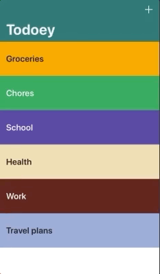

# Todoey

An iOS to-do list type app.

This app was created through the 18th module of [Angela Yu appbrewery's course on Udemy](https://www.udemy.com/ios-12-app-development-bootcamp/).

# Pods used

- **RealmSwift**: For persisting data.
- **SwipeCellKit**: For the swipe interaction with each item.
- **ChameleonFramework**: For the colors and contrasts on the UI.

# This is the final result

